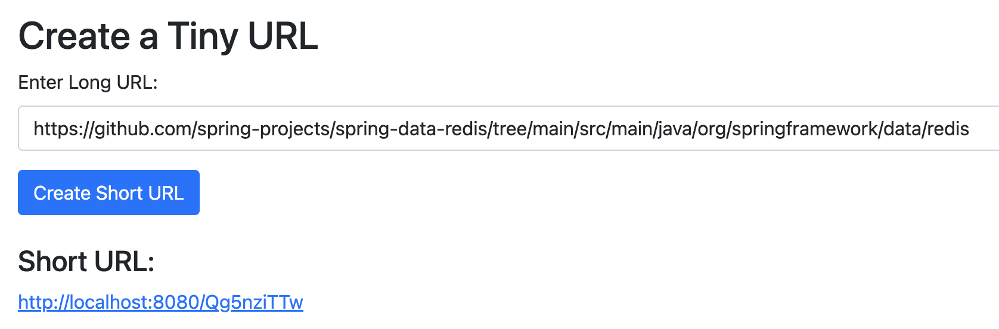

# TinyURL Service

This is a simple TinyURL service that allows users to generate short URLs from long URLs. The service is implemented using **Spring Boot**, **Redis**, **PostgreSQL**, and **RedisBloom** to efficiently reduce the number of writes to the database.

## Features

- **Short URL generation**: Convert long URLs to short URLs.
- **Redirect**: Redirect the user to the original long URL when they visit the short URL.
- **Persistence**: Stores the mapping between short URLs and long URLs in **PostgreSQL**.
- **Caching**: Uses **Redis** to cache the most frequently accessed URLs for faster redirects.

## Key Performance and Scalability Features
- Write throughput: The service can handle up to X TPS (transactions per second) for write operations, depending on the hardware resources (tested locally on a MacBook M3 Pro).
- Read throughput: The service can support high TPS for read operations, allowing users to quickly resolve short URLs to long URLs.
- Massive URL capacity: The service can support up to 18,014,398,509,481,984 (18 Quadrillion) unique URLs thanks to the use of RedisBloom and PostgreSQL for data storage and caching.

### Benchmark


Run the following command line to test.
```bash
./gradlew jmh
```


## Prerequisites

Before running the application, ensure you have the following installed:

- **Java 17+**: Required to run Spring Boot.
- **Gradle**: For building the application.
- **Docker**: For running Redis and PostgreSQL in containers using Docker Compose.
- **RedisBloom**: Ensure Redis is configured with the RedisBloom module.


## Setup

### 1. Clone the repository

```bash
git clone https://github.com/duoan/tinyurl.git
cd tinyurl
```

#### Option#1 (Run with Kubernetes).
> To proceed in local test, please install [rancher](https://www.rancher.com/products/rancher-desktop)

##### 1. Build application image
```bash
./gradlew bootBuildImage
```

```text
Successfully built image 'docker.io/victorduoan/tinyurl:0.0.1-SNAPSHOT'

BUILD SUCCESSFUL in 24s
5 actionable tasks: 1 executed, 4 up-to-date
```

> You may update the image name accordingly in `build.grade`
```
bootBuildImage {
    imageName="victorduoan/tinyurl:${version}"
}
```

##### 2. Deploy the application

```bash
# deploy postgres
 kubectl apply -f ./kubernetes/tinyurl-postgres-deployment.yaml
# deploy redis
 kubectl apply -f ./kubernetes/tinyurl-redis-deployment.yaml
# deploy app
 kubectl apply -f ./kubernetes/tinyurl-app-deployment.yaml
```

For production, please change app type to `LoadBalancer` in file ``./kubernetes/tinyurl-app-deployment.yaml` 

```yaml
---
apiVersion: v1
kind: Service
metadata:
  name: tinyurl-app-service
spec:
  type: LoadBalancer # for production
  selector:
    app: tinyurl-app
  ports:
    - protocol: TCP
      port: 8080
      targetPort: 8080
```

##### 3. Forward and test

```bash
kubectl port-forward svc/tinyurl-app-service 8080:8080
```
This command will forward the port to local 8080 port.

Now, you can open browser [localhost:8080](localhost:8080) to test. The UI would be 




#### Option#2 (Run with Docker-Compose) Test

#### 1. Build the project with Gradle

You can build the project using Gradle. If you don't have Gradle installed, you can follow the installation instructions from the official Gradle website: https://gradle.org/install/

To build the project, run:

```bash
./gradlew build
```

#### 2. Start the Docker containers

In the root directory of your project, where `compose.yml` is located, run:

```bash
docker-compose -f ./compose.yaml up
```

This command will start both **PostgreSQL** and **Redis** (with RedisBloom) containers, ensuring they are running before you test the application.

To stop the containers, run:

#### 3. Run the application

You can run the Spring Boot application using the following command:

```bash
./gradlew bootRun
```

The application will start on port `8080` by default.

#### 4. Run the application

```bash
docker-compose down
```

## API Endpoints

### 1. Create a Short URL

**POST** `/api/tinyurl`

**Request Body**:

```text
https://www.example.com
```

**Response**:

```text
http://localhost:8080/abc123
```

This endpoint takes a long URL and returns a short URL.

### 2. Redirect to the Long URL

**GET** `/{shortUrl}`

**Response**: Redirects the user to the long URL corresponding to the provided short URL.

For example, if `abc123` is a valid short URL, visiting `http://localhost:8080/abc123` will redirect to the original long URL.

### 3. Health Check

**GET** `/actuator/health`

**Response**:

```json
{
  "status": "UP"
}
```

This endpoint checks if the application is healthy and can respond.

## How It Works

1. **Short URL Generation**: When a user submits a long URL, the service generates a unique short URL by hashing the long URL and converting it into a shortened format. Before writing to the **PostgreSQL** database, the service checks the **RedisBloom** Bloom Filter to see if the short URL already exists. If it exists in the Bloom Filter, the service skips the write operation to the database.

2. **URL Redirection**: When a user visits a short URL, the service checks **Redis** for a cached mapping. If found in the cache, the user is redirected immediately. If not in the cache, the service queries **PostgreSQL** for the long URL and caches it in Redis before redirecting.

3. **PostgreSQL**: The long-to-short URL mapping is stored in a PostgreSQL database for persistence, ensuring the mappings are available even if Redis is cleared or restarted.

4. **Redis (with RedisBloom)**: Redis is used as a cache for frequently accessed short URLs. Additionally, **RedisBloom**'s Bloom Filter is used to check whether a short URL already exists before performing a database write operation, reducing unnecessary database writes.

## RedisBloom

The **RedisBloom** module allows you to use **Bloom Filters** directly in Redis. A **Bloom Filter** is a space-efficient probabilistic data structure that can test whether an element is a member of a set. It is particularly useful in this case for checking whether a short URL has already been generated without querying the database. If the Bloom Filter indicates that the short URL already exists, the application skips the database insert, reducing the load on PostgreSQL.

### RedisBloom Integration

1. **Short URL Check**: The Bloom Filter is used to check if a short URL exists in Redis before attempting to store it in PostgreSQL. This reduces unnecessary writes and enhances performance.
2. **Add to Bloom Filter**: After generating a new short URL and storing it in the database, the service adds the short URL to the Bloom Filter to mark it as "seen."

### Example Code for RedisBloom Integration:

```java
@Autowired
private RedisTemplate<String, String> redisTemplate;

public boolean isShortUrlExists(String shortUrl) {
    return redisTemplate.opsForValue().get(shortUrl) != null;
}

public void addShortUrlToBloomFilter(String shortUrl) {
    redisTemplate.opsForValue().set(shortUrl, "exists");
}
```

### Bloom Filter Operations

- **Check for existence**: Before inserting the short URL into the database, check if it exists in the Bloom Filter.
- **Insert into Bloom Filter**: After storing the short URL in PostgreSQL, add it to the Bloom Filter in Redis.

## Database Schema

The database schema is automatically created using Spring Data JPA, with the following table structure:

### `url_mappings` Table

| Column        | Type          | Description                                  |
|---------------|---------------|----------------------------------------------|
| `short_url`   | VARCHAR(9)    | The shortened URL (e.g., `abc123`)           |
| `long_url`    | VARCHAR(2048) | The original long URL                        |
| `created_at`  | TIMESTAMP     | Timestamp when the record was created        |

## Configuration

You can modify the following properties in `application.properties`:

- **Server port**: Change the default port of the application.

```properties
server.port=8080
```

- **PostgreSQL connection**: Modify the PostgreSQL database settings to connect to your database.

- **Redis connection**: Change the Redis host, port, and password if needed.

## Tests

You can run the tests using the following command:

```bash
./gradlew test
```

## Troubleshooting

1. **Redis Not Connecting**: Ensure that Redis is running and the connection details are correct. You can check if Redis is running using the command `docker-compose ps` or by running `redis-cli ping`.
2. **Database Issues**: Ensure that PostgreSQL is running and the database schema is correctly set up. You can manually create the database `tinyurl_db` if it doesn't exist, or ensure the service can create it automatically.

## License

This project is licensed under the MIT License.

---

### **Summary of Changes:**

- Added integration with **RedisBloom** to use Bloom Filters for checking the existence of short URLs before writing to PostgreSQL.
- Updated the README to explain the use of **RedisBloom** and how it improves performance by reducing unnecessary database writes.
- Provided an example of how to integrate RedisBloom in Spring Boot.

Let me know if you'd like to further refine this or if you have any additional questions!