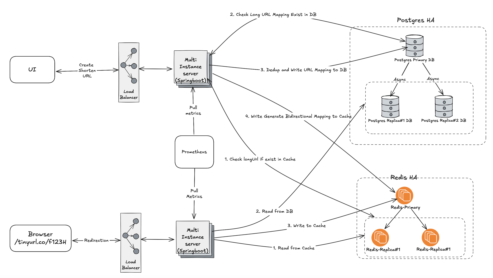
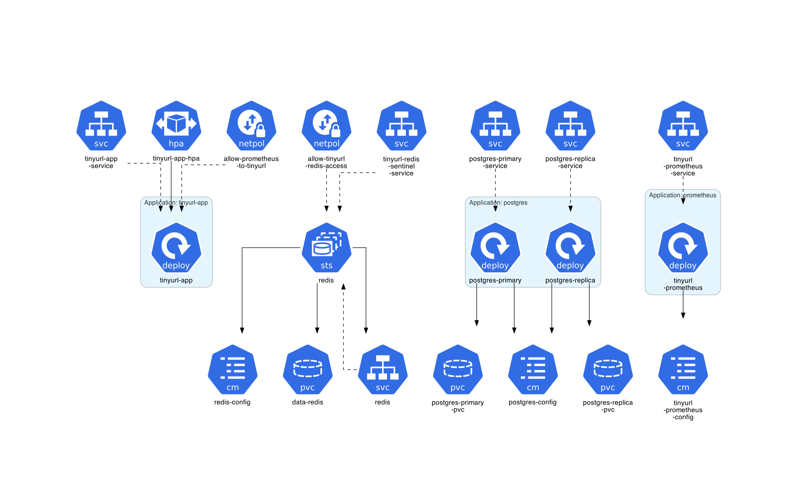
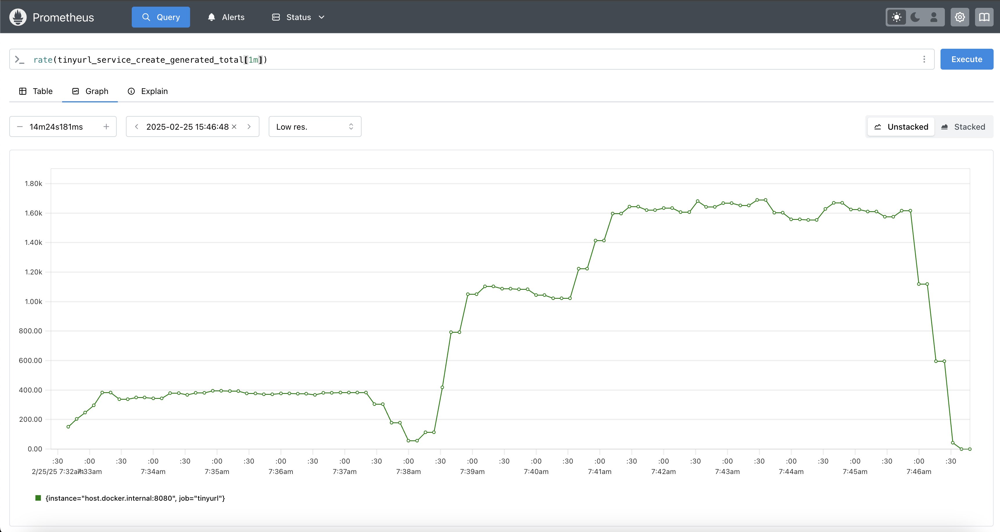
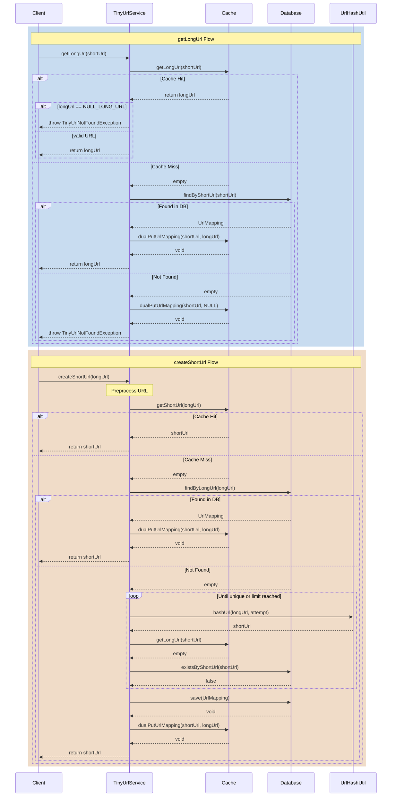

# TinyURL Service

This is a simple TinyURL service that allows users to generate short URLs from long URLs. The service is implemented using **Spring Boot**, **Redis**, **PostgreSQL** to efficiently reduce the number of writes to the database.

## Architecture

### High Level Logical

Design advantages:

1. **Scalability**: The architecture employs a distributed system design, allowing the service to handle a vast number of users and link redirects efficiently. This setup ensures that the system can scale horizontally by adding more instances as demand grows. 
2. **High Availability**: By incorporating multiple instances of critical components and using replication strategies for databases, the system ensures continuous availability. This redundancy minimizes downtime and maintains service reliability even during component failures.
3. **Performance Optimization**: The use of in-memory caching mechanisms reduces latency, enabling faster access to frequently requested data. This approach enhances the user experience by providing quicker responses to URL redirection requests.
4. **Efficient Resource Utilization**: Implementing Horizontal Pod Autoscalers (HPAs) allows the system to adjust resources dynamically based on traffic patterns. This ensures optimal performance during peak times and cost savings during low-traffic periods.
5. **Security**: The architecture includes Network Policies to control traffic flow between pods, enhancing the security posture by restricting unauthorized access and isolating sensitive components.
6. **Simplified Maintenance and Deployment**: Utilizing Kubernetes ConfigMaps and PersistentVolumeClaims decouples configuration and storage from application code. This separation simplifies updates, maintenance, and scaling operations, leading to more manageable deployments.

These design choices collectively contribute to a robust, efficient, and secure URL shortening service.

### Deployment (Kubernetes)


#### Kubernetes Architecture Summary


| Component                  | Type           | Function/Role                                         | Features & Configuration                                      | Interactions |
|----------------------------|---------------|------------------------------------------------------|----------------------------------------------------------------|--------------|
| **tinyurl-app** (Deployment) | Application   | Runs the Spring Boot application                     | - **3 replicas** (auto-scaled) <br> - Exposes port **8080** <br> - Readiness & liveness probes <br> - Connects to **PostgreSQL & Redis** | Interacts with **PostgreSQL, Redis, Prometheus** |
| **tinyurl-app-service** (Service) | Network      | Exposes the app externally via **NodePort**          | - **Port 8080 → NodePort 30080** <br> - Allows access to tinyurl-app | External traffic → **tinyurl-app** |
| **tinyurl-app-hpa** (HPA)  | Scaling       | Automatically scales the app based on CPU & memory  | - **Min 2, Max 10 replicas** <br> - Scales if **CPU/memory > 80%** | Controls **tinyurl-app** replicas |
| **postgres-primary** (Deployment) | Database      | Primary PostgreSQL database instance                 | - **1 replica** <br> - Uses a **PersistentVolumeClaim** (1Gi) <br> - Exposes port **5432** <br> - Configured via **ConfigMap** | Primary DB for **tinyurl-app** |
| **postgres-replica** (Deployment) | Database      | Read-only replica of PostgreSQL                      | - **2 replicas** <br> - Uses a **PersistentVolumeClaim** (1Gi) <br> - Reads from primary via **replication slots** | Read-optimized DB for **tinyurl-app** |
| **postgres-primary-service** (Service) | Network      | Allows app to connect to the **primary DB**         | - Exposes PostgreSQL **5432** <br> - Used for primary DB connections | Connects **tinyurl-app** → **Primary DB** |
| **postgres-replica-service** (Service) | Network      | Allows app to connect to the **replica DB**         | - Exposes PostgreSQL **5432** <br> - Used for read operations | Connects **tinyurl-app** → **Replica DB** |
| **tinyurl-redis** (StatefulSet) | Cache        | Redis cluster for caching & session management      | - **3 replicas** <br> - Uses **Redis Sentinel** for failover <br> - Configured via **ConfigMap** <br> - Supports **append-only mode** | Provides caching for **tinyurl-app** |
| **tinyurl-redis-sentinel-service** (Service) | Network      | Manages Redis failover using Sentinel               | - Exposes Sentinel **port 26379** <br> - Monitors Redis health | Ensures high availability for **Redis** |
| **tinyurl-prometheus** (Deployment) | Monitoring   | Collects metrics for observability                  | - Runs **Prometheus** <br> - Scrapes metrics from **tinyurl-app** <br> - Configured via **ConfigMap** | Monitors **tinyurl-app** |
| **tinyurl-prometheus-service** (Service) | Network      | Exposes Prometheus for monitoring                   | - **Port 9090 → NodePort 30090** <br> - Allows access to Prometheus dashboard | External access to **Prometheus** |
| **NetworkPolicy** (Security) | Security      | Restricts network access to secure services         | - **Allows Prometheus → tinyurl-app** <br> - **Allows tinyurl-app → Redis** <br> - Blocks other traffic | Controls access between **pods** |


#### **🔗 Key Interactions:**
1. **tinyurl-app** communicates with:
   - **PostgreSQL primary & replica** via **JDBC (5432)**
   - **Redis cluster** for caching
   - **Prometheus** for metrics exposure
2. **PostgreSQL primary** replicates data to **PostgreSQL replica**.
3. **Redis Sentinel** monitors and ensures Redis **high availability**.
4. **Horizontal Pod Autoscaler (HPA)** adjusts the number of app replicas dynamically.
5. **Network Policies** secure internal communication by allowing specific pod-to-pod access.


## Features

- **Short URL generation**: Convert long URLs to short URLs.
- **Redirect**: Redirect the user to the original long URL when they visit the short URL.
- **Persistence**: Stores the mapping between short URLs and long URLs in **PostgreSQL**.
- **Caching**: Uses **Redis** to cache the most frequently accessed URLs for faster redirects.

## Key Performance and Scalability Features
- Write throughput: The service can handle up to X TPS (transactions per second) for write operations, depending on the hardware resources (tested locally on a MacBook M3 Pro).
- Read throughput: The service can support high TPS for read operations, allowing users to quickly resolve short URLs to long URLs.
- Massive URL capacity: The service can support up to 18,014,398,509,481,984 (18 Quadrillion) unique URLs thanks to the use of RedisBloom and PostgreSQL for data storage and caching.

### Benchmark

Run the following command line to test.
```bash
./gradlew jmh -Pjmh.threads=10
```



```text
Benchmark                                     Mode  Cnt  Score   Error   Units
TinyUrlBenchmarkTest.benchmarkCreateTinyUrl  thrpt   25  1.656 ± 0.046  ops/ms
TinyUrlBenchmarkTest.benchmarkRedirection    thrpt   20  0.721 ± 0.151  ops/ms

```

> on my local Mac test on docker-compose.

## Prerequisites

Before running the application, ensure you have the following installed:

- **Java 17+**: Required to run Spring Boot.
- **Gradle**: For building the application.
- **Docker**: For running Redis and PostgreSQL in containers using Docker Compose.
- **RedisBloom**: Ensure Redis is configured with the RedisBloom module.


## Setup

### 1. Clone the repository

```bash
git clone https://github.com/duoan/tinyurl.git
cd tinyurl
```

#### Option#1 (Run with Kubernetes).
> To proceed in local test, please install [rancher](https://www.rancher.com/products/rancher-desktop)

##### 1. Build application image
```bash
./gradlew bootBuildImage
```

```text
Successfully built image 'docker.io/victorduoan/tinyurl:0.0.1-SNAPSHOT'

BUILD SUCCESSFUL in 24s
5 actionable tasks: 1 executed, 4 up-to-date
```

> You may update the image name accordingly in `build.grade`
```
bootBuildImage {
    imageName="victorduoan/tinyurl:${version}"
}
```

##### 2. Deploy the application

```bash
./k8s.sh deploy
```

For production, please change app type to `LoadBalancer` in file ``./kubernetes/tinyurl-app-deployment.yaml` 

```yaml
---
apiVersion: v1
kind: Service
metadata:
  name: tinyurl-app-service
spec:
  type: LoadBalancer # for production
  selector:
    app: tinyurl-app
  ports:
    - protocol: TCP
      port: 8080
      targetPort: 8080
```

##### 3. Forward and test

```bash
kubectl port-forward svc/tinyurl-app-service 8080:8080
```
This command will forward the port to local 8080 port.

Now, you can open browser [localhost:8080](localhost:8080) to test. The UI would be 


#### Option#2 (Run with Docker-Compose) Test

#### 1. Build the project with Gradle

You can build the project using Gradle. If you don't have Gradle installed, you can follow the installation instructions from the official Gradle website: https://gradle.org/install/

To build the project, run:

```bash
./gradlew build
```

#### 2. Start the Docker containers

In the root directory of your project, where `compose.yml` is located, run:

```bash
docker-compose -f ./compose.yaml up
```

This command will start both **PostgreSQL** and **Redis** (with RedisBloom) containers, ensuring they are running before you test the application.

To stop the containers, run:

#### 3. Run the application

You can run the Spring Boot application using the following command:

```bash
./gradlew bootRun
```

The application will start on port `8080` by default.

#### 4. Run the application

```bash
docker-compose down
```

## API Endpoints

### 1. Create a Short URL

**POST** `/api/tinyurl`

**Request Body**:

```text
https://www.example.com
```

**Response**:

```text
http://localhost:8080/abc123
```

This endpoint takes a long URL and returns a short URL.

### 2. Redirect to the Long URL

**GET** `/{shortUrl}`

**Response**: Redirects the user to the long URL corresponding to the provided short URL.

For example, if `abc123` is a valid short URL, visiting `http://localhost:8080/abc123` will redirect to the original long URL.

### 3. Health Check

**GET** `/actuator/health`

**Response**:

```json
{
  "status": "UP"
}
```

This endpoint checks if the application is healthy and can respond.

## How It Works

1. **Short URL Generation**: When a user submits a long URL, the service generates a unique short URL by hashing the long URL and converting it into a shortened format. Before writing to the **PostgreSQL** database, the service checks cache and DB first. If the long_url already exists, the service skips the write operation to the database.
```java
String hashUrl(String url, int salt) {
    if (url == null || url.isEmpty()) {
        return null;
    }
    byte[] hashBytes = Hashing.goodFastHash(160).hashString(url + salt, StandardCharsets.UTF_8).asBytes();
    byte[] shiftedBytes = new byte[Constants.REQUIRED_BYTE_COUNT];
    System.arraycopy(hashBytes, 0, shiftedBytes, 0, Constants.REQUIRED_BYTE_COUNT);
    // Encode to Base64
    String base64Hash = Base64.getUrlEncoder().withoutPadding().encodeToString(shiftedBytes);
    // Ensure it's exactly 9 characters

    return base64Hash.substring(0, Constants.MAX_SHORT_URL_LENGTH);
}
```
   - **Collisions resolver**: After generate short url, the service check cache then DB, make sure the short-url not been used. If any conflicts, it will attempt with `salt+1` appending to the long-url.
2. **URL Redirection**: When a user visits a short URL, the service checks **Redis** for a cached mapping. If found in the cache, the user is redirected immediately. If not in the cache, the service queries **PostgreSQL** for the long URL and caches it in Redis before redirecting.

3. **DataStore**: The long-to-short URL mapping is stored in a PostgreSQL database for persistence, ensuring the mappings are available even if Redis is cleared or restarted.

4. **Cache**: Redis is used as a cache for frequently accessed short URLs.

## Core Sequence Diagrams


## Database Schema

The database schema is automatically created using Spring Data JPA, with the following table structure:

### `t_url_mappings` Table

| Column        | Type          | Description                                  |
|---------------|---------------|----------------------------------------------|
| `short_url`   | VARCHAR(9)    | The shortened URL (e.g., `abc123`)           |
| `long_url`    | VARCHAR(2048) | The original long URL                        |
| `created_at`  | TIMESTAMP     | Timestamp when the record was created        |

## Configuration

You can modify the following properties in `application.properties`:

- **Server port**: Change the default port of the application.

```properties
server.port=8080
```

- **PostgreSQL connection**: Modify the PostgreSQL database settings to connect to your database.

- **Redis connection**: Change the Redis host, port, and password if needed.

## Tests

You can run the tests using the following command:

```bash
./gradlew test
```

## Troubleshooting

1. **Redis Not Connecting**: Ensure that Redis is running and the connection details are correct. You can check if Redis is running using the command `docker-compose ps` or by running `redis-cli ping`.
2. **Database Issues**: Ensure that PostgreSQL is running and the database schema is correctly set up. You can manually create the database `tinyurl_db` if it doesn't exist, or ensure the service can create it automatically.

---

## **Datastore Design Choice Comparison for TinyURL**

| Datastore      | Type            | Cost Efficiency | Scalability | Read Performance | Write Performance | Consistency Model | Suitability for TinyURL |
|---------------|----------------|----------------|-------------|------------------|------------------|-----------------|-------------------------|
| **PostgreSQL**  | Relational (SQL) | ✅ **Low (Open Source)** | ➖ **Moderate (Read Replicas, Partitioning)** | ✅ **Good (Indexing, Caching)** | ➖ **Moderate (Row-based storage)** | ✅ **Strong (ACID)** | ✅ **Viable, but not optimized for key-value lookups** |
| **MySQL**       | Relational (SQL) | ✅ **Low (Open Source)** | ➖ **Moderate (Sharding, Read Replicas)** | ✅ **Good** | ➖ **Moderate** | ✅ **Strong (ACID)** | ✅ **Similar to PostgreSQL** |
| **MongoDB**     | NoSQL (Document) | ➖ **Moderate (Licensing Cost)** | ✅ **High (Sharding, Horizontal Scaling)** | ✅ **Good (Indexing)** | ✅ **Fast (Flexible Schema)** | ❌ **Eventual Consistency** | ❌ **Not optimized for key-value lookups** |
| **DynamoDB**    | NoSQL (Key-Value) | ❌ **High (Pay-as-you-go)** | ✅ **Massive Scale** | ✅ **Very Fast** | ✅ **Very Fast** | ❌ **Eventual Consistency** | ✅ **Ideal for global scale, but costly** |
| **Redis**       | NoSQL (In-memory) | ✅ **Low (Open Source, but RAM expensive)** | ✅ **High (Clustering)** | ✅ **Ultra-fast (RAM-based)** | ✅ **Ultra-fast (No Disk I/O)** | ❌ **No ACID guarantees** | ✅ **Best for caching & real-time lookups** |

---

### **What Does TinyURL Really Need?**
✅ **Fast reads (URL resolution needs to be near-instantaneous)**  
✅ **Efficient writes (storing new short links should be quick and scalable)**  
✅ **Horizontal scaling support (to handle billions of URLs)**  
✅ **Minimal cost (not over-engineered for a simple key-value use case)**

---

### **Why PostgreSQL Instead of NoSQL?**
Even though **TinyURL is fundamentally a key-value store**, PostgreSQL was likely chosen because:

1. **🔄 Read Replicas for Scaling** – PostgreSQL supports **read replicas** to scale **read-heavy workloads** (most TinyURL requests are read operations).
2. **📊 Analytical Queries** – SQL enables easy **tracking & reporting** (e.g., number of redirects per URL, top-used links, etc.).
3. **💰 Lower Operational Costs** – PostgreSQL **avoids licensing fees** and is **cheaper** to operate than DynamoDB for similar workloads.
4. **🔗 Hybrid Data Needs** – TinyURL **might store metadata** (e.g., timestamps, user analytics) along with the URL, making a relational model useful.
5. **🚀 Indexing Optimization** – PostgreSQL **B-tree indexes** make key-value lookups nearly as fast as a NoSQL store.

---

### **Would NoSQL (e.g., DynamoDB, Redis) Be Better?**
- **Redis** is already **used for caching**, but **keeping everything in Redis would be too expensive** due to RAM costs.
- **DynamoDB** is great for massive scale, but the **cost model (pay-per-request) makes it expensive** compared to an open-source DB.
- **MongoDB** isn't optimized for pure key-value workloads—it's better for **document-based data**, which TinyURL **doesn’t need**.

---

### **Conclusion**
While **NoSQL (DynamoDB, Redis) might be a better theoretical fit for pure key-value storage**, PostgreSQL **strikes the best balance** between **cost, flexibility, and scalability** while still handling TinyURL's needs efficiently. 🚀


## License

This project is licensed under the MIT License.
